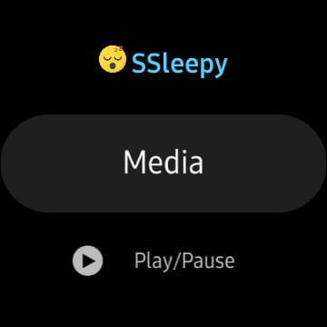

# SSleepy App Active
Application to control Windows remotely with Samsung Galaxy Watch Active 2.

<p align="center">
  
</p>

# Features
* Shutdown
* Restart
* Play
* Pause
* Next
* Previous
* Volume Up
* Volume Down
* Mute
* Close
* Fullscreen
* Mouse
* Left Click
* Right Click

# Prerequisites
* [SSleepy Server](https://github.com/xxgicoxx/ssleepy-server)
* [Tizen Studio](https://developer.tizen.org/development/tizen-studio/download)

# Running
### 1. Run
````
# Import Project on Tizen Studio
File > Import > Tizen > Tizen Project

# Start
Right click on SSleepy > Run As > Tizen Web Application
````

# Built With
* [Tizen](https://docs.tizen.org/application/web/index)

# Authors
* [xxgicoxx](https://github.com/xxgicoxx)

# Acknowledgments
* [FlatIcon](https://www.flaticon.com/)